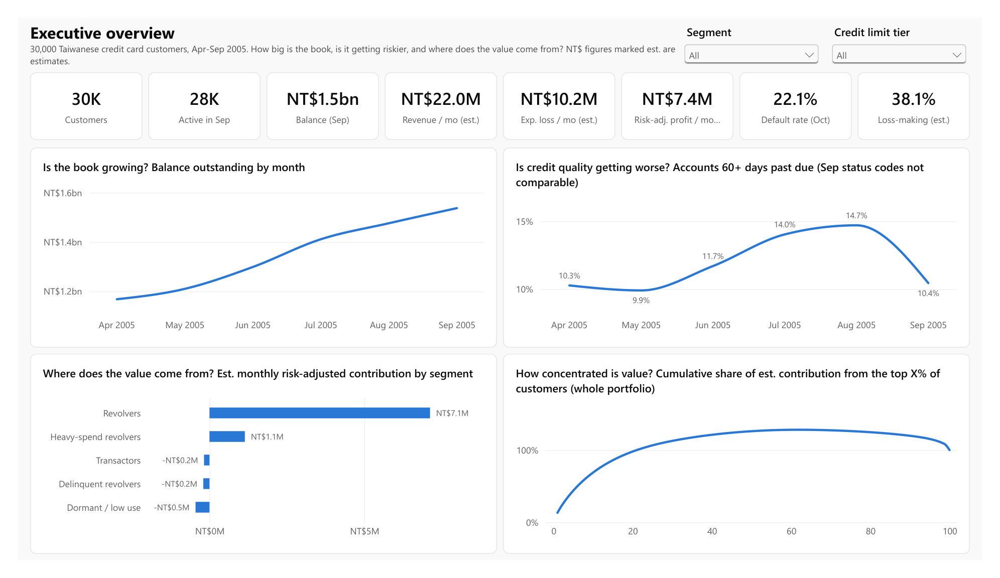
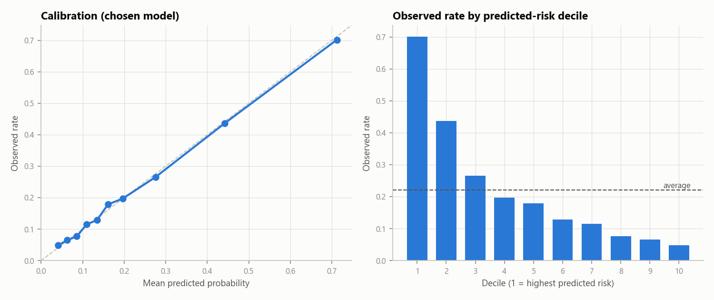
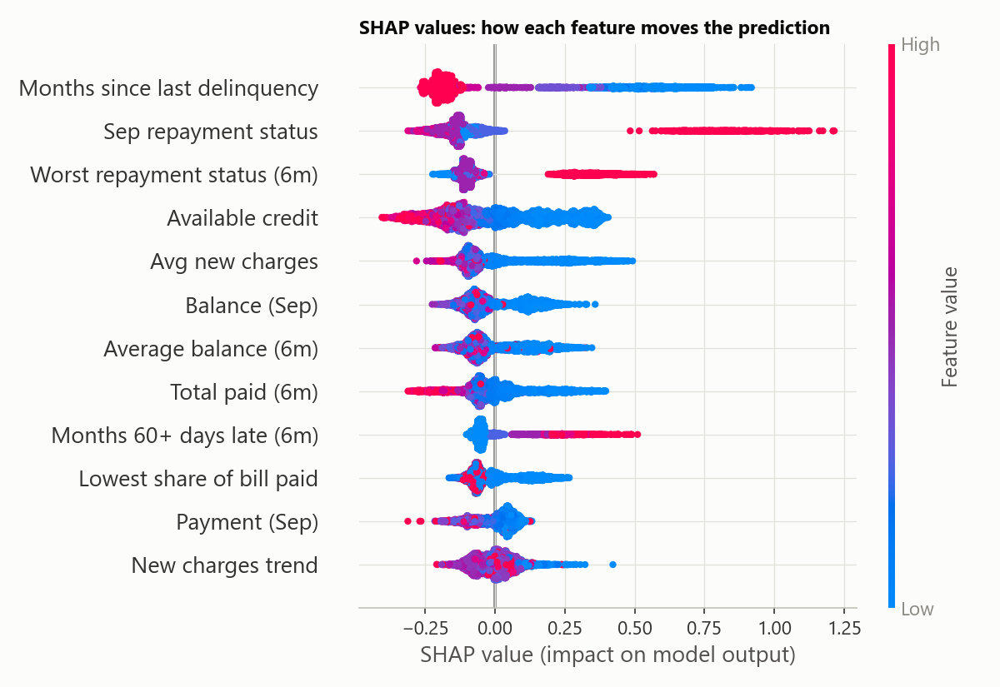
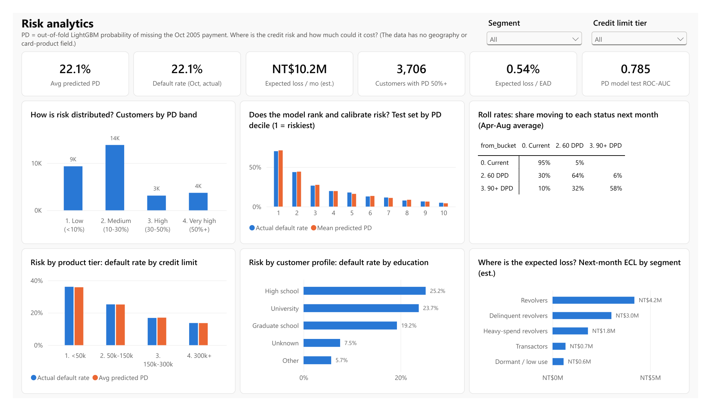
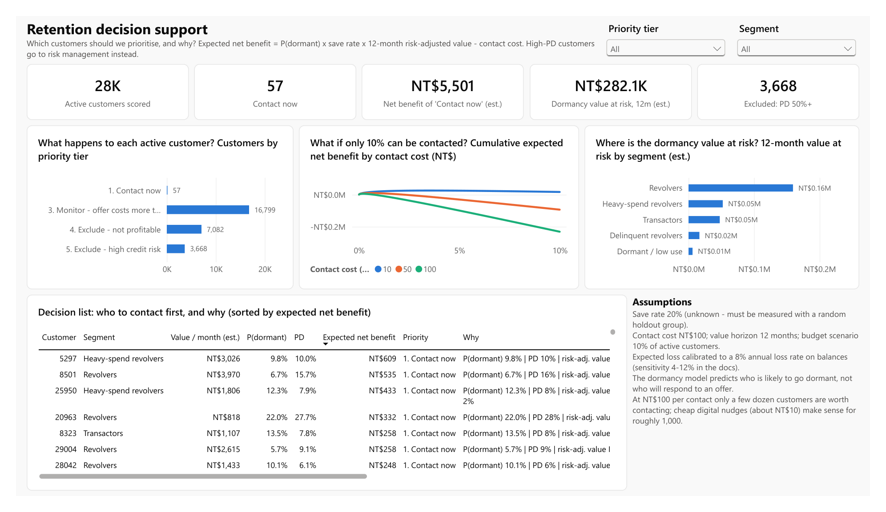

# Credit Card Customer Intelligence & Risk Analytics

An end-to-end analytics project on 30,000 real credit card customers: Python ingestion and data-quality checks,
a PostgreSQL data model built in SQL, a credit-risk (PD) model and a dormancy ("churn") model with SHAP
explanations, an estimated profitability model, customer segmentation, and a retention prioritisation that
combines all of them. The results are shown in a four-page Power BI dashboard that reads from the warehouse.



## 1. What the project does

It answers one practical question: **which customers should a card issuer focus on, and why?** To get there it
works out, for every customer:

- how likely they are to miss their next payment (PD model),
- how likely they are to stop using the card (dormancy model),
- roughly how much money they make for the issuer after expected credit losses,
- which behavioural segment they belong to,

and then decides who is worth a retention contact and who should go to risk management instead.

## 2. Why I built it

I wanted a project that looks like real work with messy business data rather than a single modeling notebook:
data that needs checking and reshaping, a database that does real work, two models with different time designs,
business assumptions that have to be stated, and a decision at the end. I also wanted to practise being honest
about what the data can and cannot support.

## 3. Dataset

[UCI Default of Credit Card Clients](https://archive.ics.uci.edu/dataset/350/default+of+credit+card+clients)
(Yeh & Lien, 2009; CC BY 4.0). 30,000 customers of a Taiwanese bank, April-September 2005:
credit limit, sex, education, marital status, age, and for each month the repayment status, bill amount and
payment amount, plus whether the customer missed their October payment (22.1% did).

What it doesn't have: transactions, merchants, geography, card product, income, credit score, marketing data or
account closures. I didn't fabricate any of these; there is **no synthetic data** in the project. I compared it
with two other public datasets (Kaggle BankChurners and IBM's synthetic TabFormer) - see `docs/methodology.md`.

## 4. Tools

Python 3.13 (pandas, scikit-learn, LightGBM, SHAP, statsmodels/scipy, matplotlib), PostgreSQL 17 (psycopg 3),
pytest, Jupyter, Power BI Desktop (saved as a text-based `.pbip` project; see section 12).

## 5. How the pipeline works

```
UCI .xls ──► extract (download, SHA-256 check, read as text)
         ──► validate (24 checks: ERROR rows quarantined, WARN rows flagged)
         ──► PostgreSQL raw / staging / audit  (COPY, truncate + load = idempotent)
         ──► SQL: core star schema ──► feature tables ──► descriptive marts
         ──► Python: PD model, dormancy model, SHAP, K-means  ──► ml.* tables
         ──► SQL: profitability, customer 360, retention priority marts
         ──► export: analysis tables, significance tests, data-quality report
         ──► Power BI: semantic model + report generated from the warehouse (scripts/build_powerbi.py)
```

One command runs it: `python -m src.pipeline` (8-15 minutes, almost all of it model training and SHAP).
Runs are reproducible: seeds are fixed and LightGBM runs in deterministic mode, and two consecutive runs
produced identical scores for every customer (I compared checksums of the score tables).

**Data-quality checks** include types, nulls, non-integer amounts, duplicate IDs, impossible ages/limits,
out-of-range status codes, negative payments, undocumented category codes, credit balances, over-limit balances,
implausible payments, duplicate profiles, late status with nothing owed, balance drops not explained by payments,
schema and checksum checks, and a check for the repayment-status coding change described below. No rows failed
an ERROR check; the warnings and how each is handled are in [`docs/data_quality_report.md`](docs/data_quality_report.md)
(generated by the pipeline).

Two findings from this stage shaped everything after it:

1. **A payment pays the previous month's bill** (exact matches 17.6% vs 2.6% for the same month). That gives
   `new charges = bill_t - bill_(t-1) + payment_t`, which is how activity, purchases and interest are estimated.
2. **The repayment-status coding changes in September** ("1 month late" is almost unused in Apr-Aug and appears
   3,688 times in Sep). Month-to-month comparisons use 60+ days past due, and the dormancy model avoids raw codes.

## 6. Database design

Schemas follow the data flow: `raw -> staging -> core -> features -> ml -> mart`, plus `audit`.
Full dictionary with grain and keys: [`docs/data_dictionary.md`](docs/data_dictionary.md).

| Table | Grain | Notes |
|---|---|---|
| `core.dim_customer` | customer | decoded demographics, limit tier, DQ flags |
| `core.dim_month` | month | Apr-Oct 2005 |
| `core.fact_account_month` | customer x month (180k rows) | unpivoted with `CROSS JOIN LATERAL`; new charges, utilization, payment ratio, delinquency bucket, inactivity |
| `core.fact_default_outcome` | customer | the label, kept apart from all feature SQL |
| `features.customer_risk_features` | customer | PD features (Apr-Sep) |
| `features.churn_snapshots` | customer x snapshot month | dormancy features (`LAG`) and label (`LEAD`) |
| `mart.portfolio_monthly`, `roll_rates`, `delinquency_cohorts` | month / transition / cohort | descriptive credit-risk views |
| `mart.customer_profitability` | customer | estimated revenue, costs, expected loss |
| `mart.customer_360` | customer | everything about a customer in one row |
| `mart.retention_priority` | active customer | value at risk, expected net benefit, priority tier and reason |

SQL techniques used: CTEs, `LATERAL` unpivot, `LAG`/`LEAD`, rolling and running window aggregates,
`ROW_NUMBER`, `NTILE`, `PERCENT_RANK`, `FILTER` (conditional aggregation), `REGR_SLOPE`, `PERCENTILE_CONT`,
`GROUPING SETS`, cohort and roll-rate analysis, constraints and foreign keys.

## 7. Machine learning

### Credit risk (PD)
- **Target:** missed payment in October 2005. **Features:** 31 features from April-September (delinquency
  history, utilization and its trend, payment behaviour, spending, available credit, age, education). Sex and
  marital status are not used.
- **Validation:** stratified 80/20 customer split (there is only one label month), 5-fold CV for tuning and
  model selection. Downstream scores are out-of-fold so no customer is scored by a model that saw their label.

| Model | CV ROC-AUC | Test ROC-AUC | Test PR-AUC | Test Brier |
|---|---:|---:|---:|---:|
| Logistic regression | 0.777 | 0.770 | 0.534 | 0.138 |
| Random forest | 0.789 | 0.783 | 0.566 | 0.134 |
| **LightGBM (chosen)** | **0.789** | **0.785** | **0.566** | **0.134** |

Base rate 22.1%. LightGBM's probabilities were already well calibrated (ECE 0.006), so no calibration layer
was added. The top decile of predicted risk had a 70% default rate (3.2x average); at a 0.5 threshold precision is
0.67 and recall 0.37, at 0.3 they are 0.54 and 0.56. Predictions are calibrated within each sex as well.



### Dormancy ("churn")
- **Target:** an active customer has nothing owed and no new charges in **both** of the next two months
  (1.2-1.6% per month). The data has no closures, and inactivity is how issuers usually measure attrition.
- **Validation:** train on the May snapshot, test on the July snapshot. Training labels (Jun-Jul) end before the
  test snapshot, so the test is truly out-of-time.

| Model | CV PR-AUC (sd) | Test ROC-AUC | Test PR-AUC |
|---|---:|---:|---:|
| Logistic regression | 0.129 (0.020) | 0.903 | 0.116 |
| **Random forest (chosen on CV)** | **0.159 (0.030)** | **0.900** | **0.108** |
| LightGBM | 0.146 (0.028) | 0.911 | 0.132 |
| LightGBM, class-weighted | 0.142 (0.025) | 0.909 | 0.130 (Brier 0.063 vs 0.011) |

Base rate on the test snapshot is 1.2%. The top 10% by predicted risk contains 68% of the customers who went
dormant (6.8x lift). The random forest was chosen on CV, but LightGBM did better out-of-time; the CV gap was within
one standard deviation. I kept the pre-test choice rather than pick a model using the test set - with more data
I would select on rolling out-of-time folds. Class weighting didn't help ranking and ruined calibration.

### Explainability
TreeSHAP for both models: global importance, beeswarm plots and per-customer reason codes stored with the scores
(e.g. *"PD 88.7% - raises risk: months since last delinquency 0; Sep status 2 months late; ..."*). The strongest PD
drivers are how recently the customer was late, current and worst repayment status, and available credit; the
strongest dormancy drivers are a low and shrinking balance/utilization. These are associations, not causes.



## 8. Segmentation

K-means on six behaviour ratios. k = 4 had the best silhouette (0.449) and k = 5 was close (0.430); both are very
stable under bootstrap resampling (ARI ~0.99). I used k = 5 because it separates heavy-spend revolvers.

| Segment | Customers | Oct default rate | Avg P(dormant) | Est. monthly risk-adj. contribution |
|---|---:|---:|---:|---:|
| Revolvers | 12,073 | 16.3% | 0.3% | NT$7.1M |
| Heavy-spend revolvers | 4,026 | 20.3% | 0.3% | NT$1.1M |
| Transactors | 7,181 | 14.4% | 2.7% | -NT$0.2M |
| Delinquent revolvers | 3,156 | 62.8% | 0.5% | -NT$0.2M |
| Dormant / low use | 3,564 | 23.4% | 7.1% | -NT$0.5M |

## 9. Profitability (estimated)

`risk-adjusted contribution = interest + interchange + late fees - rewards - funding - servicing - expected loss`,
per customer per month. Balances and payments are observed; rates and costs are assumptions in
`config/config.yaml`; expected loss = PD x EAD x LGD x charge-off share.

The dataset's "default" is a late payment, not a write-off, and the data has no charge-offs. My first version
used a charge-off share taken from the cohort analysis and produced 98% loss-making customers, so I changed to a
top-down calibration: the charge-off share is set so that annual expected loss equals 8% of balances (US bank card
charge-offs ran ~3% in 2006 and peaked near 10.5% in 2009; Taiwan was in a card-debt crisis in 2005-06).

Estimated portfolio (monthly): revenue NT$22.0M, operating costs NT$4.3M, expected loss NT$10.2M, risk-adjusted
contribution NT$7.4M. At 4% / 12% annual loss rates the contribution would be NT$12.6M / NT$2.3M. **This is an
educational estimate for ranking customers, not accounting profit.**

## 10. Retention prioritisation

For each customer active in September: expected net benefit of a contact =
P(dormant) x save rate (20%) x 12 months of risk-adjusted value - contact cost (NT$100). Customers with PD >= 50%
go to risk management, loss-making customers are excluded, the rest are ranked.

Result: 57 customers are "Contact now", 16,799 are "Monitor" (an offer costs more than it's expected to save),
7,082 are not profitable and 3,668 are excluded for credit risk. With cheaper contacts the list grows (about 960
customers at NT$10 per contact), but a 10% budget is never the binding constraint.

## 11. Main findings

1. Balances grew 32% over six months while 60+ DPD delinquency went from ~10% to ~15% - the book got riskier.
2. Ordinary revolvers produce ~96% of estimated contribution; the top 10% of customers produce 69% of it.
3. Delinquent revolvers hold 11% of balances but 29% of expected loss; their revenue is almost fully offset by it.
4. Customers likely to go dormant are mostly low-value; the 12-month value at risk from dormancy (~NT$0.3M) is
   small next to monthly expected credit loss (~NT$10M). Over half of that value at risk (NT$0.16M) still sits
   with ordinary revolvers - each is unlikely to go dormant, but there are many of them and each is valuable.

**Recommendations** (details, evidence and risks in [`docs/business_recommendations.md`](docs/business_recommendations.md)):
prioritise credit-risk actions for the high-PD group; use cheap channels for a short retention list; measure any
retention campaign with a randomised holdout before scaling it; don't grow limits for delinquent revolvers but
decide on PD rather than segment, since about half of new 60+ DPD accounts cure; keep the profitable revolvers
happy without unnecessary offers.

## 12. Power BI dashboard

Four pages, each built around one question: **Executive overview** (size, trend, where value comes from),
**Customer analytics** (segments, spending, demographics), **Risk analytics** (PD distribution, model calibration
by decile, roll rates, risk by limit tier and education, expected loss by segment) and **Retention decision
support** (priority tiers, budget curve, value at risk and a ranked contact list with reasons). The data has no
geography or card-product field, so credit-limit tier stands in for product tier.

The report is stored as a Power BI Project (`.pbip`): the semantic model (11 tables imported from Postgres,
4 relationships, 42 DAX measures) and the report (52 visuals) are plain-text files generated by
`scripts/build_powerbi.py`. That keeps the dashboard in version control and reproducible. Details, including
two bugs I fixed after the first render (a `KEEPFILTERS` issue in the roll-rate matrix and a currency format
string), are in [`dashboard/powerbi/README.md`](dashboard/powerbi/README.md). A PDF export of all four pages is
in [`dashboard/powerbi/CreditCardIntelligence.pdf`](dashboard/powerbi/CreditCardIntelligence.pdf).





## 13. Limitations

- Six months from one bank in one (crisis) period; no out-of-time test for PD.
- "Default" is a broad missed-payment label; "churn" is a two-month dormancy proxy.
- Revenue, cost and loss numbers rest on assumptions; the loss level is calibrated to an external benchmark.
- The dormancy model predicts risk, not response to an offer; the save rate is assumed.
- No transaction, product, geography or marketing data.
- Credit limit is observed once and assumed constant over the period.

## 14. Future improvements

- Longer history: 6-12 month inactivity definition and rolling out-of-time validation for both models.
- An uplift model once campaign data with a holdout exists.
- Score monitoring (PSI, calibration by month) and scheduled, incremental loads.
- A proper fairness review of age and education as PD inputs.

## 15. How to run it

**Requirements:** Python 3.11+ (tested on 3.13) and any PostgreSQL 13+ server.

```bash
python -m pip install -r requirements.txt
```

**Database.** Either point the project at an existing server, or on Windows use the portable setup script
(downloads nothing itself; unzip the [EDB binaries](https://www.enterprisedb.com/download-postgresql-binaries) to
`%USERPROFILE%\pgsql` first). It creates a local cluster, generates a password and writes `.env`:

```bash
powershell -ExecutionPolicy Bypass -File scripts/setup_local_postgres.ps1
```

Otherwise copy `.env.example` to `.env` and set `DATABASE_URL`, then create the database (`CREATE DATABASE cc_intel;`).

**Run the pipeline** (downloads the dataset on the first run and verifies its checksum):

```bash
python -m src.pipeline
```

Individual steps: `python -m src.pipeline --steps ingest,sql,model,marts,export`.

**Tests** (65 tests; database tests are skipped if the warehouse hasn't been built):

```bash
python -m pytest
```

**Notebooks** (re-executed top to bottom against the database):

```bash
python scripts/build_notebooks.py
```

**Power BI.** The project in `dashboard/powerbi/` is already generated. Open `CreditCardIntelligence.pbip` in
Power BI Desktop, click Refresh and sign in with the database credentials from `.env`. To regenerate it after
changing the generator (with Power BI closed):

```bash
python scripts/build_powerbi.py
```

## Repository layout

```
config/config.yaml          paths, month mapping, validation thresholds, all business assumptions
sql/staging/                schemas, raw/staging/audit tables
sql/transformations/        core star schema
sql/features/               model feature tables
sql/marts/                  descriptive and decision marts
sql/analysis/               queries behind the findings and dashboard
src/ingestion/              extract + load (+ run_ingestion orchestration)
src/validation/             data-quality checks
src/modeling/               features, training/evaluation, SHAP
src/evaluation/             metrics and figures
src/analytics/              segmentation, assumptions, analysis exports
src/pipeline.py             entry point
notebooks/                  01 EDA, 02 features, 03 modeling, 04 business analysis
scripts/                    Postgres setup, notebook builder, Power BI generator, screenshot export
dashboard/powerbi/          Power BI project (.pbip: TMDL model + PBIR report), PDF export, screenshots
docs/                       methodology, data dictionary, DQ report, recommendations, interview prep
reports/                    model results, analysis tables, figures (generated)
tests/                      pytest suite
```
