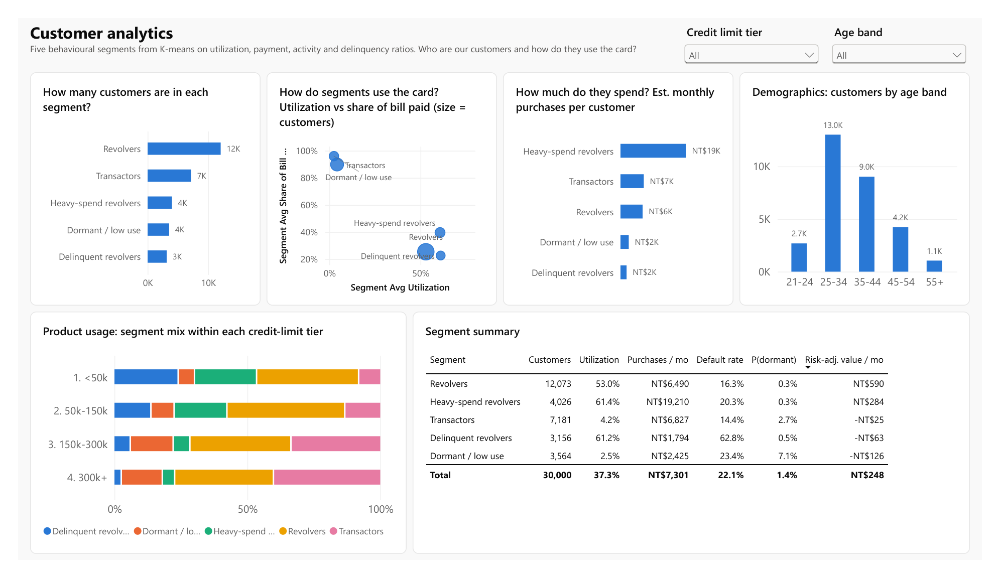

# Power BI dashboard

A four-page Power BI report built on the PostgreSQL warehouse. It is stored as a **Power BI Project
(`.pbip`)**: the data model is in TMDL and the report in PBIR, both plain text, so the dashboard is
version-controlled like the rest of the code and changes show up as readable diffs.

| Page | Question it answers |
|---|---|
| 1 Executive overview | How big is the book, is it getting riskier, and where does the value come from? |
| 2 Customer analytics | Who are our customers and how do they use the card? |
| 3 Risk analytics | Where is the credit risk, how much could it cost, and does the PD model rank it well? |
| 4 Retention decision support | Which customers should we prioritise, and why? |

`CreditCardIntelligence.pdf` is a full export of the report, and `screenshots/` has one image per page.

## How it was built

I created an empty project once in Power BI Desktop (File > Save as > `.pbip`), so the files use the exact
format versions of the installed Desktop (2.158, September 2026). `scripts/build_powerbi.py` then generates
the rest from the warehouse:

- **Semantic model** (`CreditCardIntelligence.SemanticModel/definition/`)
  - 11 import tables read straight from Postgres (`mart`, `core` and `ml` schemas). Column data types are
    taken from `information_schema`, so the model always matches the database.
  - Two parameters (`PgServer`, `PgDatabase`), so the server is configured in one place.
  - 4 relationships forming a small star around `customer_360`:

    | From (many) | To (one) |
    |---|---|
    | `customer_monthly.customer_id` | `customer_360.customer_id` |
    | `customer_monthly.month_index` | `dim_month.month_index` |
    | `retention_priority.customer_id` | `customer_360.customer_id` |
    | `customer_360.segment` | `segment_profile.segment` |

    The curve, lift, roll-rate, model-comparison and assumptions tables are already aggregated, so they stay
    disconnected.
  - A `_Measures` table with 42 DAX measures in display folders (Portfolio, Economics, Customers, Risk,
    Retention). Visuals use measures rather than implicit column sums, so every number has one definition.
- **Report** (`CreditCardIntelligence.Report/definition/`): 4 pages and 52 visuals. Every chart title is the
  business question it answers. The colour theme (`theme.json`) is a colour-blind-checked palette.

Before opening it in Power BI, I validated all generated report files against Microsoft's published JSON schemas.
`tests/test_powerbi.py` also checks that every field a visual uses and every column a measure references exists
in the model.

### Things I had to fix after the first render
- **Roll-rate matrix showed 100% in every cell.** The measure filtered `to_bucket <> "1. 30 DPD"` inside
  `CALCULATE`, and a plain filter argument *replaces* the matrix's own filter on that column. Wrapping it in
  `KEEPFILTERS` intersects the filters instead.
- **Currency format `NT$#,0` rendered as `%mt$#,0`.** The letters have to be escaped: `\N\T\$#,0`.
- A 27,000-point scatter of value vs dormancy risk was unreadable (nearly all points close to zero, and a log axis
  can't show the zeros), so I replaced it with value at risk by segment.

## Opening it

1. Make sure PostgreSQL is running and the pipeline has been run (`python -m src.pipeline`).
2. Open `CreditCardIntelligence.pbip` in Power BI Desktop and click **Refresh**.
3. Sign in with database credentials (user `postgres` and the password from `.env`). If Power BI asks about an
   encrypted connection, choose to continue without encryption (the server is local).
4. To point at a different server: Transform data > Edit parameters > `PgServer` / `PgDatabase`.

To regenerate the project after changing the generator: close Power BI Desktop, run
`python scripts/build_powerbi.py`, reopen and refresh. To update the screenshots: export to PDF over
`CreditCardIntelligence.pdf`, then run `python scripts/export_dashboard_images.py`.

The packaged `.pbix` (about 17 MB including the data) isn't committed, because git would store a new copy of the
binary on every save. It's meant to be attached to a GitHub Release instead.
